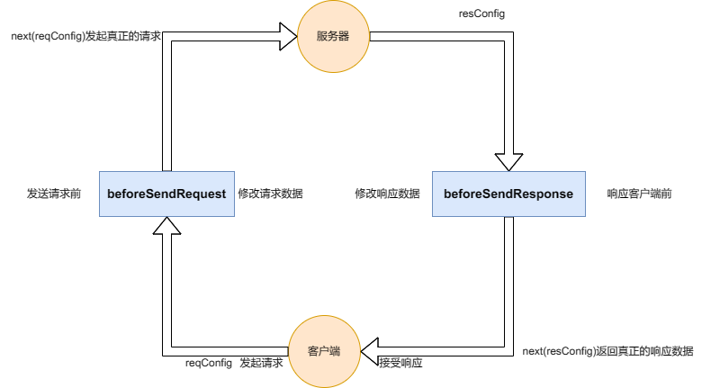

## 默认规则

```js
* http-handle://
```
默认规则路径 js 文件为项目下的当前用户文件home文件夹下的 whistle.handle.rules/index.js,例如：
`windows:C:\Users\Administrator\whistle.http-handle.rules`
`android:/sdcard/whistle.http-handle.rules/index.js`

## 配置 whistle 规则 rules

匹配的域名 http-handle://自定义规则路径

```js
wwww.baidu.com http-handle://E:\code\my\whistle.http-handle\index.js
```

## 流程图



## 规则

- reqConfig 真正请求时的数据配置
  - url 请求的 url
  - method 请求的方法
  - headers 头信息
  - query 查询字符串对象
  - bodyType body 的类型 formData|form|json|text
  - body 数据 string|object

- reqConfig 返回客户端时的数据配置
  - statusCode 状态码
  - headers 头信息
  - body 数据 string|object|buffer object 时自动转为 json 字符串

- next 传递给下一个请求的配置 传递false时为阻止请求或者响应
  - reqConfig
  - reqConfig


## 修改响应图片示例
```js
const fs = require("fs");
const util = require("util");
const readFileAsync = util.promisify(fs.readFile);

module.exports = [
  {
    // 匹配的 url  **为多个通配字符，*为单个统配字符
    // 例如：https://www.baidu.com/action/**
    url: "**", //匹配所有请求url
    // 匹配的 method *表示所有
    method: "get",
    // 发送真正请求前 调用next()修改数据
    beforeSendRequest(reqConfig, next) {
      next(reqConfig);
    },
    // 返回响应给客户端前 调用next()修改数据
    beforeSendResponse(reqConfig, resConfig, next) {
      //判断响应的的类型是否是图片
      if (resConfig.headers["content-type"].includes("image")) {
        console.log("拦截图片响应...");
        // 读取本地文件
        const imagePath = "/storage/emulated/0/Pictures/cropedIMG_20230719_160944.jpg.png";
        readFileAsync(imagePath)
          .then(imageData => (resConfig.body = imageData)) // 将图片数据替换
          .catch(error => console.error(error))
          .finally(() => {
            next(resConfig); // 把响应给客户端
          });
      } else {
        next(resConfig); // 不是图片则不修改直接返回
      }
    }
  }
];
```
